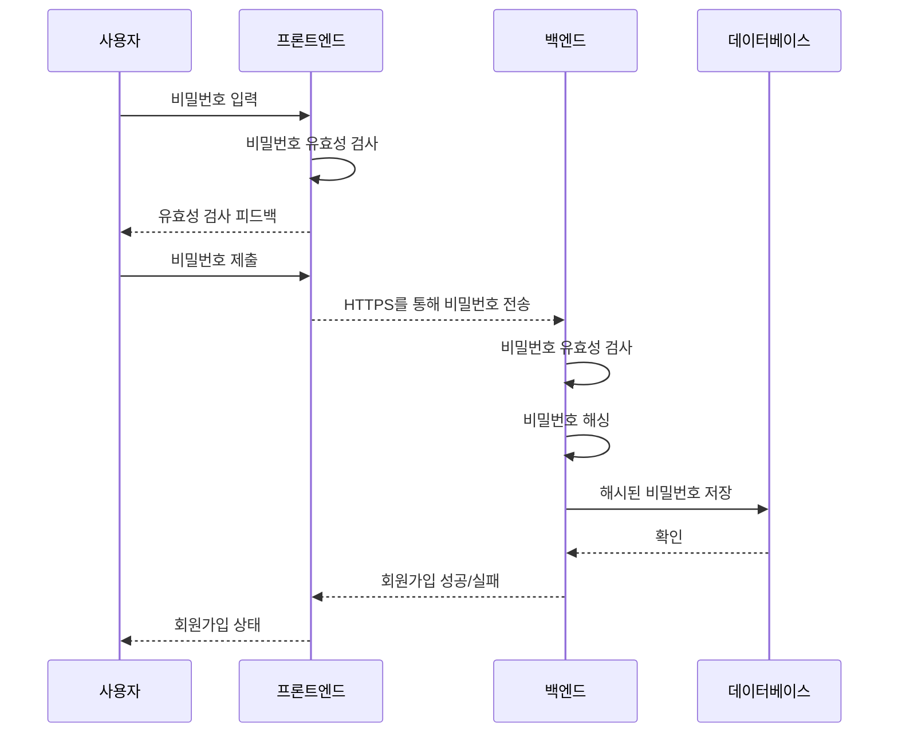

# Today list  : 회원 가입

#### 비밀번호 유효성 체크 흐름도

### 패스워드 유효성 검사
**프론트 엔드**
- 패스워드 길이
- 패스워드 복잡성(대/소문자, 숫자, 특수문자)
- 강도 표시 (길이와 복잡성에 따른 보안 강도 표시)
- 블랙리스트 (password, 1234 와 같은 알려진 비밀번호 차단)

**백엔드**
- 패스워드 길이
- 패스워드 복잡성(대/소문자, 숫자, 특수문자)
- 강도 표시 (길이와 복잡성에 따른 보안 강도 표시)
- 블랙리스트 (password, 1234 와 같은 알려진 비밀번호 차단)
- 이전 사용한 비밀번호인지 확인

- *이번 프로젝트에선 <u>패스워드 길이</u>, <u>복잡성</u>에 대한 것만 우선적으로 구현해야겠다.*
- **패스워드 유효성 검사는 요청을 처리하기전 유효성을 검사하는 <u>미들웨어로 사용된다.</u>. 따라서 이를 사용하는 부분은 라우터에서 볼 수 있다.
- 이메일 중복확인 같은 경우에는 주로 서비스 또는 컨트롤러 단에서 이루어진다.
	- 이메일 중복 확인 같은 경우에는 비즈니스 로직의 일부로 간주되기 때문이다.
	- 클라이언트가 회원가입을 요청하면, 요청된 이메일이 데이터베이스에 이미 존재하는지 확ㅇ니해야 하는데, 이런 로직은 서비스 계층에서 처리하고, 그 결과에 따라 컨트롤러에서 적절한 응답을 반환하게 된다.
> 데이터 검증 로직은 클라이언트 요청이 어플리케이션의 비즈니스 로직을 수행되기 전에 실행되어야 한다. 
> 그래서 라우터에서 검증을 처리하면, 잘못된 요청이 컨트롤러나 서비스 계층에 도달하기 전에 걸러낼 수 있다.

### express-vaildator
Node.js에서 Express 애플리케이션을 위해 제공되는 강력한 유효성 검사 및 산출 라이브러리.
**장점**
- 표준화된 에러 응답 자동 제공 : 일관성 유지
	- `express-vaildator`는 표준화된 에러 응답을 자동으로 제공한다.
	- 이를 통해 <u>에러처리를 일관되게 유지</u>할 수 있다.
- 코드 가독성 : 체이닝 방식 제공
	- `express-vaildator`는 체이닝(chaining)방식의 API를 제공한다.
	- 이를 통해 코드를 더 읽기 쉽고 관리하기 쉽게 만들 수 있다.
- 확장성 
	- `express-vaildator`는 다양한 검증 및 산출 옵션을 제공한다.
	- 커스텀 검증 및 산출 함수를 정의할 수 있다
- 보안
	- 입력값을 검증함으로써 SQL Injection과 같은 공격응로부터 보호할 수 있다.
- 효율성
	- 모든 요청 데이터를 한번에 검증할 수 있다.
	- body, params, query 등의 요청에서 오는 데이터를 간편하게 검증 가능하다.

- [사용 참고 블로그1](https://choice91.tistory.com/59)
- [사용 참고 블로그2](https://choice91.tistory.com/59)