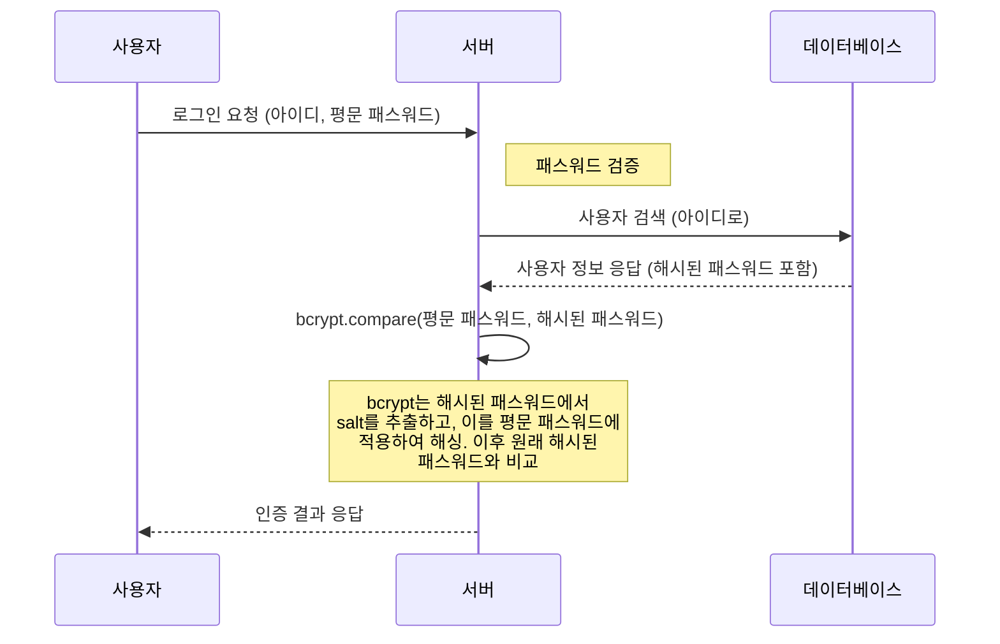

# Today list  : 회원 가입 2

### express-validator `check` 함수
- express-validator 라이브러리의 일부로, **<u>Express 라우트 핸들러의 미들웨어로 작동하도록 설계</u>** 되었다.
	- 따라서 직접 호출하려고 하면 에러가 발생한다.
- `check` 함수는 특정 필드에 대한 유효성 검사를 설정하는 데 사용되며, 이는 Express 라우트 핸들러로 전달되어 요청의 해당 필드를 검사하게 된다.

**사용 방법**
```js
const { check } = require('express-validator');

app.post('/user', [
  // 'username' 필드를 검사하고 싶다면 첫 번째 인자로 'username'을 넘긴다.
  check('username')
    // isEmail() 메서드를 체이닝하여 'username' 필드가 이메일 형식인지 확인할 수 있다.
    .isEmail()
    // withMessage() 메서드를 체이닝하여 유효성 검사 실패 시 반환할 메시지를 설정한다.
    .withMessage('Must be a valid email'),

  // 다음은 'password' 필드에 대한 검사다.
  check('password')
    .isLength({ min: 8 })
    .withMessage('Must be at least 8 characters long'),
  // 앞의 체이닝된 메서드들을 통해 여러 가지 유효성 검사를 적용할 수 있다.

  (req, res) => {
    // 요청 처리 로직이 여기에 들어간다.
  }
]);

```


### 에러 처리, 에러 핸들러, throw, next...
- javascript는 `throw`문을 사용하여 에러를 발생시킬 수 있지만, 이는 주로 <u>동기적인 코드</u>에서 사용되며, 비동기 코드에선 작동하지 않는다.
	- 이것은  JavaScript의 비동기 특성과 이벤트 루프의 동작 방식 때문이다.
- Express.js에서는 대부분의 코드가 비동기적으로 동작하기 때문에 에러를 전달 할 때 `next`함수를 사용하여 에러를 전달하는 것이 좋다.

``` js

router.post('/user', validationPassword, async (req, res, next) => {
  try {
    const user = await User.create(req.body);
    res.status(201).json(user);
  } catch (err) {
    if (err instanceof ValidationError) {
      res.status(400);
      next(new Error('Invalid user data'));
    } else {
      res.status(500); 
      next(err);  // 이렇게 하면 next가 호출되는 순간 Express가 에러를 감지하고, 해당 에러를 처리하기 위해 등록된 에러처리 미들웨어롤 호출한다

    }
  }
});

```


## 비밀번호 해싱하기
node.js에서 추천하는 해싱 방법
- **bctypt**
	- 시간이 지남에 따라 해시의 복잡성을 증가시키는 기능을 포함
		- 이는 더 많은 계산을 필요로 하는 해시를 생성하여 브루트 포스 공격에 대한 보호를 한다.
	- 레인보우 테이블 공격에 대한 보호를 제공하는 솔트를 자동으로 생성하여 많은 개발자들이 사용하고 검증된 라이브러리이다.
	- 단점으로는, 다른 해싱 방법에 비해 상대적으로 느릴 수 있다.
	- `Node.js` 환경경에서 더 쉽게 설치하고 사용할 수 있으며 시간이 지남에 따라 검증되어 왔기 때문에 더 많이 선택되는 편이다.
- **argon2**
	- `bcrypt`보다 더 최신의 해싱 알고리즘이며, 여러 코어와 메모리를 활용하여 GPU 기반의 공격에 대한 보호를 제공한다.
		- 이는 `bcrypt`가 제공하지 못하는 중요한 보안 기능이다.
	- 여러 암호화 대회에서 우승한 알고리즘으로, 많은 전문가들이 추천한다
	- 단점으로는, `bcrypt`보다 설치가 약간 더 복잡할 수 있으며 `Node.js`에서 네이티브 바인딩을 필요로 한다.
		- 상대적으로 새롭기 때문에 `bcrypt`만큼 널리 사용되지 않는다.
> 위 두 알고리즘은, 알고리즘은 공격에 대한 내성을 증가시키는 추가 기능을 제공한다.
>  또 자동 솔팅 기능을 제공하여, 두 사용자가 동일한 비밀번호를 가지더라도 다른 해시값이 생성되게 하며, 이는 레인보우 테이블 공격에 대한 보호를 제공한다.
>  bcrypt와 argon2는 모두 광범위한 사용 사례와 검증을 통해 자신의 효용성을 입증한 알고리즘입니다. 이것은 이러한 해싱 알고리즘의 안정성과 안전성에 대한 확신을 제공한다.

**그 외..**
1. **MD5**: MD5는 가장 오래된 해시 알고리즘 중 하나로, 빠르고 효율적이지만 안전성 문제로 인해 현재는 거의 사용되지 않습니다. 특히 MD5는 레인보우 테이블 공격에 취약하며, 충돌 공격도 가능하여 해시를 뒤돌릴 수 있는 가능성이 있습니다.
2. **SHA-1**: SHA-1은 MD5보다는 안전하지만, 2005년 이후로 여러 보안 취약점이 발견되어 현재는 추천되지 않습니다.
3. **SHA-256/SHA-512**: 이들은 SHA-2 계열에 속하는 해시 알고리즘으로, MD5 및 SHA-1의 보안 취약점을 해결한 더 안전한 대안입니다. 그러나 이들 알고리즘은 비밀번호 저장에 사용되기 보다는 파일 무결성 검증 등에 더 흔히 사용됩니다.


### bcrypt : 동기/비동기 방식에 대한 차이
- bcrypt 라이브러리는 동기/비동기 방식 전부 지원하고 있다.
- 동기/비동기 방식에 따라 사용방식이 약간 달라진다.
- **비동기적 방식 `bcrypt.hash()`**
	- 백그라운드에서 작업을 수행하고, 작업이 완료되면 콜백함수를 호출한다
		- 이는 Node.js의 주요 장점 중 하나인 비동기 I/O를 활용하는 것이며, 이를 통해 Node.js는 다른 요청을 동시에 처리할 수 있다.
		- 즉, 비밀번호를 해싱하는 동안 다른 요청을 계속 처리할 수 있다.
	- 콜백 함수를 필요로 하므로 코드의 복잡성을 증가시킬 수 있다.
- **동기적 방식 `bcrypt.hashSync()`**
	- 호출이 완료될 때까지 실행을 블록한다.
		- 해당 작업이 완료될 때까지 다른 요청을 처리하지 않는다.
	- 코드를 더 간결하게 만들지만, Node.js의 동시성을 활용하지 못한다
	- *동기적 함수는 서버의 응답성을 저하시킬 수 있으므로, 성능이 중요한 상황에서는 일반적으로 성능이 중요한 상황에서는 일반적으로 비동기적 방식을 선호한다.*
- 비밀번호 해싱과 같은 CPU집약적인 작업을 수행하는 경우, 비동기적 방식을 사용하는게 일반적으로 좋다.
	- 하지만 복잡성이 문제가 되는 경우에는 동기적 방식을 선택할 수도 있다.


### bcrypt 를 사용하여 해싱하기
#### code : 비동기
```js
const bcrypt = require('bcrypt');

const saltRounds = 10;
const myPlaintextPassword = 's0/\/\P4$$w0rD';

bcrypt.hash(myPlaintextPassword, saltRounds, function(err, hash) {
  // Store hash in your password DB.
});


```

#### code : 동기
```js
const saltRounds = 10;
const myPlaintextPassword = 's0/\/\P4$$w0rD';
const salt = bcrypt.genSaltSync(saltRounds);
const hash = bcrypt.hashSync(myPlaintextPassword, salt);

// Store hash in your password DB.

```

- **`saltRounds`** 
	- 해싱 프로세스에서 사용하는 `salt`를 생성하기 위한 반복 횟수를 나타낸다.
	- **salting**은 해시 과정에서 추가 데이터를 더해서 비밀번호를 보호하는 방법이다.
		- 이것은 같은 비밀번호가 항상 동일한 해시를 생성하는 것을 방지하고, 무차별 대입 공격 및 레인보우 테이블 공겨고가 같은 일반적인 비밀번호 공격에 대한 보호를 제공한다.
	- `saltRounds`의 값이 높을수록, 해시를 생성하는 데 더 많은 시간이 소요되는데, 인느 무차별 대입공격을 더욱 어렵게 만든다.
	- 그러나  `saltRounds`의 값이 너무 높을 경우, 비밀번호 해싱에 너무 많은 시간이 소요되어 서버 성능에 부정적인 영향을 미칠 수 있다.
	- 따라서 `saltRounds`는 보안과 성능 사이의 균형을 잘 유지하면서 적절한 값을 선택해야 한다.
	- *일반적으로 `bcrypt`에는 10-12 `saltRounds`를 사용한다고 한다.*


## 로그인



### 로그인 : 해싱된 값을 사용한, 사용자 비밀번호 확인
> "🤔 회원 가입 시 저장한 패스워드는 salt로 랜덤한 값을 저장한다고 했다.. 같은 패스워드라도 salt를 사용하면 각기 다른 hash 값이 나오는데, 패스워드를 어떻게 비교하지..?"

#### **salt**
- 'salt'는 해시 과정에서 사용되는 랜덤한 데이터이며, 실제로 'salt'를 사용하면 같은 패스워드라도 다른 해시값을 생성한다.
- <u>'salt'를 사용하면 같은 패스워드라도 다른 해시 값을 생성한다. 하지만 이 'salt'값은 해시된 패스워드에 포함되어 저장된다</u>
	- 이런 방식으로 같은 평문 패스워드라도 각각 다른 값을 가지게 되어 보안성을 높이는 동시에, <u>원본 패스워드를 확인할 수 있게 된다.</u> 
- **bcrypt** 의 `compare` 함수는 이를 알고 있으며, 해시된 패스워드에서 'salt'와 함께 해싱한 결과가 저장된해시값과 동일하다면, 사용자가 입력한 패스워드가 원래 패스워드와 일치한다는 것을 알 수 있다.
- 따라서 'salt'를 사용해도 bcrypt의 `compare`함수를 이용하면 패스워드를 올바르게 검증할 수 있다.

*👏그럼 bcrypt에서 salt를 사용해서 랜덤한 값을 원래 패스워드랑 합쳐서 해싱한다는 거고, 그 알고리즘 방식은 bcrypt만 아니까 거기서 제공해준 compare 함수를 사용하면 알아서 같은 암호인지 아닌지 알려주는 것이네..!!*

**code**

```js
const bcrypt = require('bcrypt');
// Compare the provided password with the hashed password in the database
const match = await bcrypt.compare(password1, password2);
if (!match) {
	throw new Error('Invalid password');
}
```


#### sequlize로 DB 컬럼 가져오기
```js
const foundUser = await findUser(email);

foundUser.full_name // output : 뚜비
foundUser.dataValues.full_name //output : 뚜비
```

##### *🤔근데 결과값 foundUser를 console.log로 확인해보면 이렇게 뜨던데..?*
```js
user {
  dataValues: {
    id: 4,
    full_name: '뚜비',
    email: 'user3@gmail.com',
    password: '$2b$10$lmrBY7N6XAav7sjPEhLmh..tQuSfi28kyZhOiAFALKLjWu7i7go6i',
    createdAt: 2023-07-07T04:41:28.000Z,
    updatedAt: 2023-07-07T04:41:28.000Z
  },
  _previousDataValues: {
    id: 4,
    full_name: '뚜비',
    email: 'user3@gmail.com',
    password: '$2b$10$lmrBY7N6XAav7sjPEhLmh..tQuSfi28kyZhOiAFALKLjWu7i7go6i',
    createdAt: 2023-07-07T04:41:28.000Z,
    updatedAt: 2023-07-07T04:41:28.000Z
  },
  uniqno: 1,
  _changed: Set(0) {},
  _options: {
    isNewRecord: false,
    _schema: null,
    _schemaDelimiter: '',
    raw: true,
    attributes: [
      'id',
      'full_name',
      'email',
      'password',
      'createdAt',
      'updatedAt'
    ]
  },
  isNewRecord: false
}
```
- Sequelize에서 데이터를 조회하면, Sequelize는 각각의 데이터 필드를 JavaScript의 객체의 속성으로 표현한다.
- 이 객체는 `.dataValues` 객체를 통해 접근할 수 있지만, 실제로는 `.dataValues`를 명시적으로 접근할 필요없이 바로 속성에 접근할 수 있다.
- 이는 Sequelize가 내부적으로 `.dataValues`에 있는 값을 참조하기 때문이다.
	- `foundUser.email`을 사용하면 Sequelize는 내부적으로 foundUser.dataValues.email`을 참조하게 된다.


## jwt 토큰 생성

```js
const jwt = require('jsonwebtoken');

function generateAccessToken(username) {
  // 페이로드
  const payload = {
    username,
    createdAt: Date.now(),
  };
  
  // 비밀 키
  const secret = 'yourSecretKey';

  // 토큰 옵션
  const options = {
    expiresIn: '1h',  // 토큰의 유효기간 설정 (예: 1시간)
  };

  // 토큰 생성
  const token = jwt.sign(payload, secret, options);
  
  return token;
}

const token = generateAccessToken('testUser');
console.log(token);

```


### 💥 문제 발생 : index.js로 service 폴더를 관리하던 중 순환종속성 문제 발생!!

#### 문제 상황
1. **현재 파일 구조**
```
./services/
├── authService.js
├── index.js
├── taskService.js
└── userService.js
```

2. 순환 종속성 문제 발생 배경
> - `passwordHash`(비밀번호를 bcrypt를 사용해 해시로 만드는 함수)
> - `generateAccessToken`(jwt 토큰을 만드는 함수)
> 위 두 함수를 `services` 폴더 내부의 `authService.js` 파일 내부에 생성하고, 이를 `index.js` 를 통해 `userService.js`에서 사용하려고 하던 중 발생

**index.js**
```js
const taskService = require("./taskService");
const userService = require("./userService");
const authService = require("./authService");

module.exports = {
taskService,
userService,
authService,
};
```

**userService.js**
```js
const { check, validationResult } = require("express-validator");
const bcrypt = require("bcrypt");
const { User } = require("../models/index");
const { authService } = require("./index");

...

const jwt = authService.generateAccessToken({
email: foundUser.email,
full_name: foundUser.full_name,
});

...
```


3. 순환 종속성 문제 발생

```
┌─────────────┐         ┌─────────────┐
│             │         │             │
│ authService │<--------│ userService │
│             │         │             │
└─────────────┘         └─────────────┘
      ▲                       ▲
      │                       │
┌───────────┐         ┌───────────┐
│           │         │           │
│  index.js │-------->│  User.js  │
│           │         │           │
└───────────┘         └───────────┘

```


**그래서...**
- `/utils` 폴더 하위에 파일을 생성하려다가, 내 프로젝트 안에선 다른 곳에서 이 함수를 쓸 일이 전혀 없어서 `/services` 하위로 다시 수정하던 중 발생했다.
- **service 에서 service를 부르는 일이 또 생길 가능성이 있다고 생각하여.. <u>index.js를 없애기로 했다..</u>😂**
