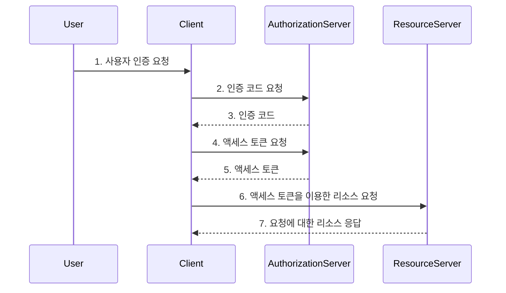

# Hello World!! 2

```
hello world!
```

테스트로 하고싶으

## mermaid 테스트


```mermaid
sequenceDiagram
  participant User
  participant Client
  participant AuthorizationServer
  participant ResourceServer

  User ->> Client: 1. 사용자 인증 요청
  Client ->> AuthorizationServer: 2. 인증 코드 요청
  AuthorizationServer -->> Client: 3. 인증 코드
  Client ->> AuthorizationServer: 4. 액세스 토큰 요청
  AuthorizationServer -->> Client: 5. 액세스 토큰

  Client ->> ResourceServer: 6. 액세스 토큰을 이용한 리소스 요청
  ResourceServer -->> Client: 7. 요청에 대한 리소스 응답

```
